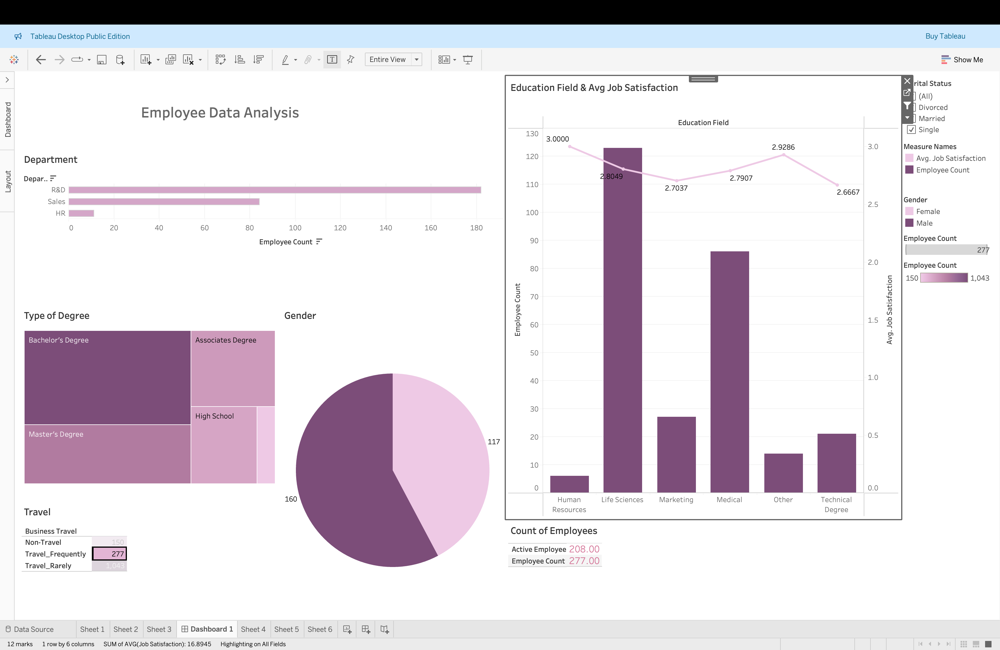

# Analyzing Employee Trends - Tableau Dashboard
---
## Project Overview
In This project you can see an interactive Tableau dashboard designed to visualize and analyze HR data, providing insights into the employee base. The dashboard integrates data from various HR systems, allowing users to explore trends in employee demographics, engagement, attrition, compensation, and performance. The objective is to enable data-driven HR decisions through intuitive visual analytics.
---
## Key Objectives
The primary goals of this dashboard are:
- Analyze employee distribution across business units and roles.
- Identify demographic trends (age, gender, education level, etc.).
- Evaluate employee satisfaction and engagement trends.
- Enable data-driven decision-making for HR strategies and initiatives.
---
## Data Sources & Structure
The dataset consists of HR records with the following key attributes:

- **emp_no**: Unique identifier for each employee.
- **gender**: Employee gender distribution.
- **marital_status**: Employee marital status.
- **age_band**: Age category grouping employees into ranges.
- **age**: Exact age of the employee.
- **department**: The department in which the employee works.
- **education**: The highest level of education attained.
- **education_field**: The field of study of the employee.
- **job_role**: The specific job title or role of the employee.
- **business_travel**: Frequency of business travel (Rarely, Frequently, or Non-travel).
- **employee_count**: Number of employees in the dataset.
- **attrition**: Indicator of whether an employee has left the company (1 for yes, 0 for no).
- **attrition_label**: Label indicating if an employee is active or has left.
- **job_satisfaction**: Employee-reported satisfaction on a scale of 1-4.
- **active_employee**: Status of whether the employee is currently active.
---
## Data Insights & Analysis
### 1. Gender Distribution
- The number of **women (588)** is significantly lower than that of **men (882)** in the dataset.
---
### 2. Business Travel Trends
- **1043 employees** (Most of them) rarely travel for business.
- **277 employees** travel frequently.
- **150 employees** do not travel at all.
---
### 3. Education Levels
- Most employees have a **Bachelor’s degree (572)**.
- **Master’s degree (398)** is the next most common.
- **Associate degree (282)** follows.
- **High School education (170)** is lower.
- The least common is a **Doctoral degree (48)**.
---
### 4. Employee Job Satisfaction by Education Field
- Employees with a **Life Sciences degree** have the highest **average job satisfaction (2.7970)**.
- **Other degrees** come next with **2.74**.
- **Medical degree holders** report **2.69**.
- **Technical degree holders** have **2.659**.
- **Marketing degree holders** average **2.654**.
- **HR professionals** have the lowest satisfaction at **2.556**.
- Higher average job satisfaction in Life Sciences could be influenced by the larger number of employees in this field.
---
## Dashboard Features & Visualizations
### 1. Headcount & Demographics Analysis
- Displays total employee count across departments.
- Breakdown of employees by age, gender, and education level.

### 2. Employee Distribution by Business Unit & Job Role
- Tree maps and bar charts visualizing workforce distribution.
- Filters allow users to explore specific job functions.

### 3. Employee Satisfaction & Engagement Trends
- Line charts tracking satisfaction scores over time.
- Comparison across departments and job roles.

### 4. HR KPIs & Metrics
- Key indicators such as employee retention rate, average tenure, and hiring trends.
- Filters to drill down by department or other factors.
---
## Interactive Features
- **Filters & Drilldowns**: Users can slice and dice data by different categories.
- **Hover Tooltips**: Additional insights on hover over data points.
- **Time-Series Analysis**: Allows tracking of trends over different time periods.
- **Comparative Analysis**: Compare different employee groups based on selected parameters.
---
## How to Use the Dashboard
1. Open the Tableau Workbook (**Analyzing Employee Trends.twbx**).
2. Navigate through different sheets/tabs for various analyses.
3. Use filters to refine data views (e.g., select specific business units, job roles, or time periods).
4. Hover over charts to view detailed insights.
5. Use comparison tools to analyze trends and correlations.

Employees with Life Sciences degrees report the highest job satisfaction, though this may be influenced by their larger representation. HR professionals have the lowest satisfaction (2.556), possibly due to role-related challenges, while Technical and Marketing fields show similar satisfaction levels (~2.65), suggesting comparable work conditions and growth opportunities.
---
## Potential Use Cases
- **HR Strategy & Workforce Planning**: Identify hiring needs, skill gaps, and retention strategies.
- **Employee Satisfaction & Engagement**: Understand factors impacting satisfaction and improve workplace culture.
- **Attrition Management**: Develop targeted retention plans based on key attrition factors.
- **Compensation & Performance Insights**: Align pay structures with performance outcomes.
---
## Conclusion
This Tableau dashboard provides HR professionals with actionable insights into employee trends, helping organizations make data-driven decisions for workforce management and planning. By leveraging interactive visualizations, users can efficiently explore employee data, identify key trends, and improve HR initiatives.
---
## Author
👩‍💻 **K. Harshitha Reddy**  
📧 harshithareddyk2002@gmail.com  
  
---
